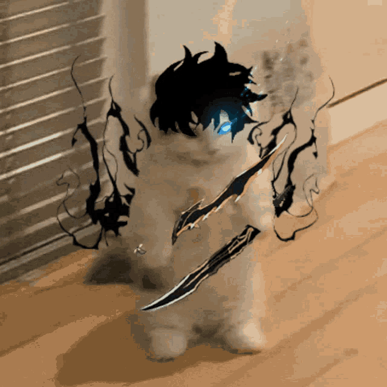

<h1 align="center">Hey there 👋, I'm SHIVA</h1>

<em>A Passionate Designer, Frontend Developer & Vibe Coder ⚡</em>

  

---

### 🔗 Connect With Me

  
  
  
  

---

### ⚡ Who is SHIVA?

🎯 Creative thinker obsessed with clean UI & pixel-perfection.  
🧩 I mix design, logic, and a bit of chaos to make the web magical.  
☕ Runs on code, coffee, and chaotic good energy.  
💡 Building, breaking, learning, growing — that’s the loop.  

---

##  <b>Skills & Stack</b>

  
  
  
  
  
  
  
  
  
  

---

### 🚀 Projects & Works

- 🎨 Personal UI Design Showcase *(coming soon)*  
- 🌐 Portfolio Website — Live & in constant evolution  
- 🧰 Mini tools & web apps on the way  
- 📁 Open-source collabs: Always open to vibing with devs  

---

### 📊 GitHub Stats

  
    
  
    
  

---

### 🐍 Contribution Snake

  

---

### 💡 Fun Animation — My Coding Journey

  

---

### 🎯 Goals for 2025

- ✅ Master React & Vue (modern frontend mastery)  
- ✅ Build a polished design portfolio  
- ✅ Open-source collabs & community learning  
- ✅ Launch a personal blog — dev + design vibes  

---

  

